# **Disclaimer**

**All information is provided for educational purposes only. Follow these instructions at your own risk. Neither the authors nor their employer are responsible for any direct or consequential damage or loss arising from any person or organization acting or failing to act on the basis of information contained in this page.**

# Content
[Introduction](#introduction)  
[Required Software](#required-software)  
[Generating the Payload](#generating-the-payload)  
[Generating the Unlock Token](#generating-the-unlock-token)  
[Peparing the SPI Flash Image](#peparing-the-spi-flash-image)  
[Integrating Files Into the Firmware Image](#integrating-files-into-the-firmware-image)  
[Disabling OEM Signing](#disabling-oem-signing)  
[Building the Firmware Image](#building-the-firmware-image)  
[Writing the Image to SPI Flash](#writing-the-image-to-spi-flash)  
[Preparing the USB Debug Cable](#preparing-the-usb-debug-cable)  
[Patching OpenIPC Configuration Files](#patching-openipc-configuration-files)  
[Decrypting OpenIPC Configuration Files](#decrypting-openipc-configuration-files)  
[Adding LMT Core to the Configuration](#adding-lmt-core-to-the-configuration)  
[Setting the IPC_PATH Environment Variable](#setting-the-ipc_path-environment-variable)  
[Performing an Initial Check of JTAG Operability](#performing-an-initial-check-of-jtag-operability)  
[Show CPU ME Thread](#show-cpu-me-thread)  
[Halting ME Core](#halting-me-core)  
[ME Debugging: Quick Start](#me-debugging-quick-start)  
[Reading Arbitrary Memory](#reading-arbitrary-memory)  
[Reading ROM](#reading-rom)  
[Why TXE?](#why-txe)  
[Authors](#authors)  
[License](#license)


# Introduction
Vulnerability [INTEL-SA-00086](https://www.intel.com/content/www/us/en/security-center/advisory/intel-sa-00086.html) allows to activate [JTAG](https://en.wikipedia.org/wiki/JTAG) for [Intel Management Engine](https://en.wikipedia.org/wiki/Intel_Management_Engine) core. We developed our [JTAG PoC][8] for the [Gigabyte Brix GP-BPCE-3350C](https://www.gigabyte.com/ru/Mini-PcBarebone/GB-BPCE-3350C-rev-10) platform. Although we recommend that would-be researchers use the same platform, other manufacturers' platforms with the [Intel Apollo Lake](https://www.intel.com/content/www/us/en/embedded/products/apollo-lake/overview.html) chipset should support the PoC as well (for TXE version  **3.0.1.1107**). 


# Required Software 

## Intel System Tools

Vulnerability *INTEL-SA-00086* involves a buffer overflow when handling a file stored on MFS (the [internal ME file system][6]). The full file path is */home/bup/ct*. You will need to integrate it into the ME firmware by using *Intel Flash Image Tool (FIT)*, one of the Intel System Tools provided by Intel to OEMs of hardware based on Intel PCH chipsets.
Here is the structure of the root directory of the Intel System Tools package:

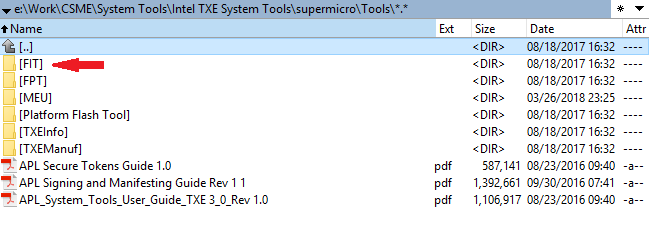

The Intel ME (TXE, SPS) System Tools utilities are not intended for end users—so you cannot find them on the official Intel website. However, some OEMs publish them as part of software updates together with device drivers. So, for integrating our PoC you need *Intel TXE System Tools* version 3.x, which can be found online.

## Intel System Studio
You need to install Intel System Studio, a trial version of which can be downloaded from Intel [site](https://software.intel.com/en-us/system-studio). In our experiments, we used *Intel System Studio 2018*.

## Intel TXE Firmware 
The PoC targets **Intel TXE firmware version 3.0.1.1107**. The SPI Flash image for [Gigabyte GB-BPCE-3350C version F5](http://download.gigabyte.eu/FileList/BIOS/brix_bios_gb-bpce-3350c_f5.zip) contains the necessary firmware version. 

## Python 
All our scripts are written on Python. We recommend using [Python 2.7](https://www.python.org/download/releases/2.7/)
Also the scripts require [pycrypto](https://pypi.org/project/pycrypto/) packet. To install *pycrypto*, run the following command:
```
pip install pycrypto
```

# Generating the Payload
Run the script **me_exp_bxtp.py**:
```
me_exp_bxtp.py -f <file_name>
```
The script generates the necessary data and exports it to the specified file (indicate either the full file path or, within the current directory, simply a name, *ct* by default). This file will be used later by *FIT*.

# Generating the Unlock Token
Run the script **me_utok_bxtp.py**:
```
me_utok_bxtp.py -f <file_name>
```
The script generates the necessary data and exports it to the specified file (indicate either the full file path or, within the current directory, simply a name, *utok.bin* by default). This file will be used later by *FIT*.

# Peparing the SPI Flash Image
To integrate *ct* and *utok.bin* files, run the *FIT* utility (*fit.exe*) and use it to open the SPI firmware image provided with your platform. For the *Gigabyte Brix GP-BPCE-3350C*, open the file downloaded from the Gigabyte link indicated above (path to image file in the archive: *F5/image.bin*).  

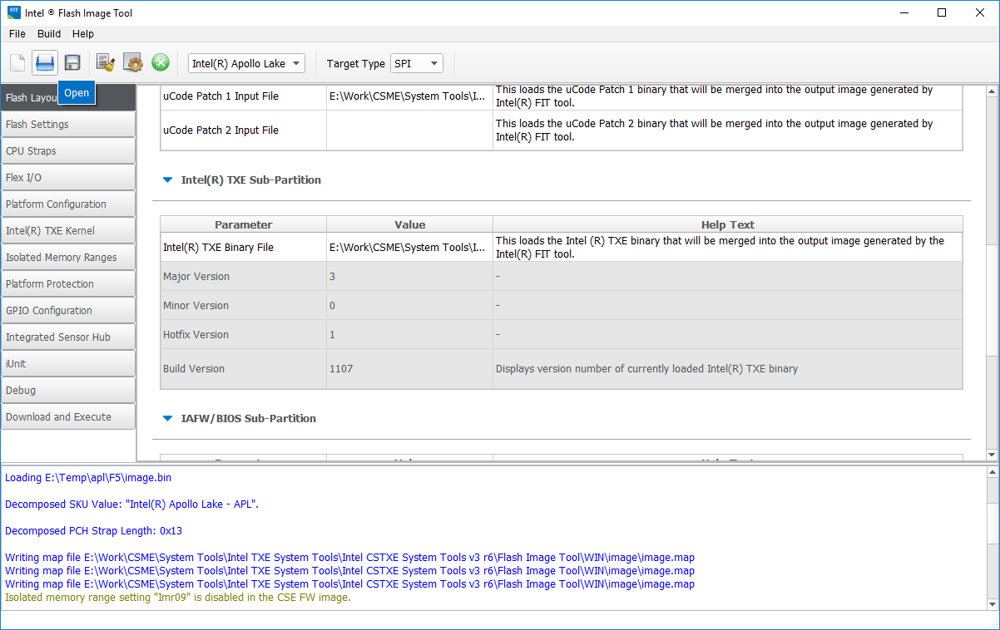

# Other Hardware Platform

If you are using an other hardware platform and don't have access to *TXE 3.0.1.1107*, you can download an SPI Flash image for [Gigabyte GB-BPCE-3350C version F5](http://download.gigabyte.eu/FileList/BIOS/brix_bios_gb-bpce-3350c_f5.zip) and extract the TXE section through *FIT*. *FIT* extracts different sections of the overall SPI image (SPI descriptor, UEFI/BIOS firmware, Intel ME firmware, and Unlock Token) when the image is opened and saves them in the folder *"image_name"/Decomp *.

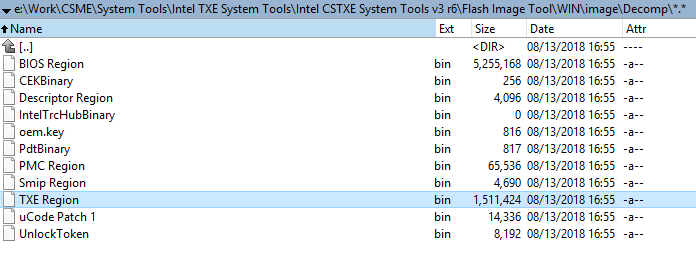

So you can find the file with necessary Intel TXE firmware at <image name>/Decomp/TXE Region.bin
Then, in *FIT*, open the SPI image for your particular platform and replace the file containing the Intel TXE firmware with the version obtained from the GB Brix 3350c image ("Intel(R) TXE Binary File" on the Flash Layout tab):

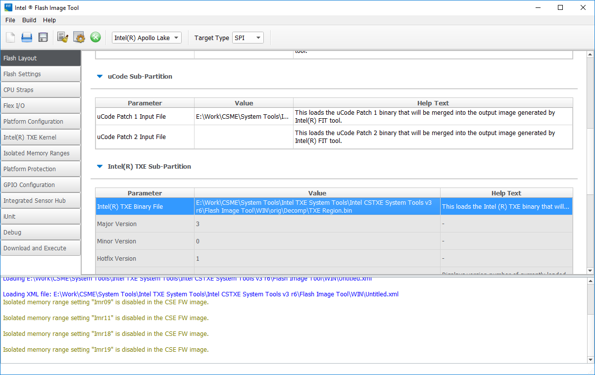

# Integrating Files Into the Firmware Image

Now we need to indicate in *FIT* the files we generated for */home/bup/ct* and *Unlock Token*. On the *Debug* tab in *FIT*, you can specify the Trace Hub Binary and Unlock Token to integrate into the firmware. These should be the files that we generated already.

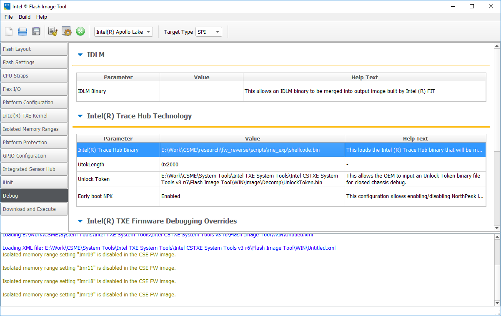

# Disabling OEM Signing
Simply remove the OEM Public Key Hash field from *FIT*:

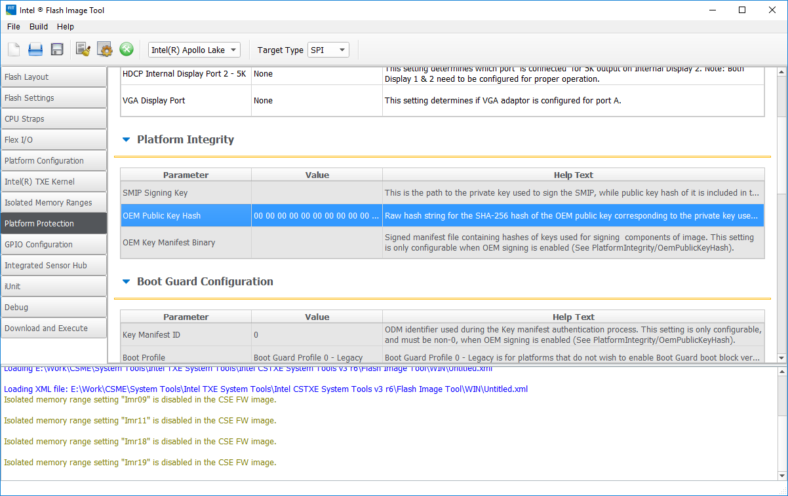

# Building the Firmware Image
Build the image by selecting *Build Image* in the *Build menu*.

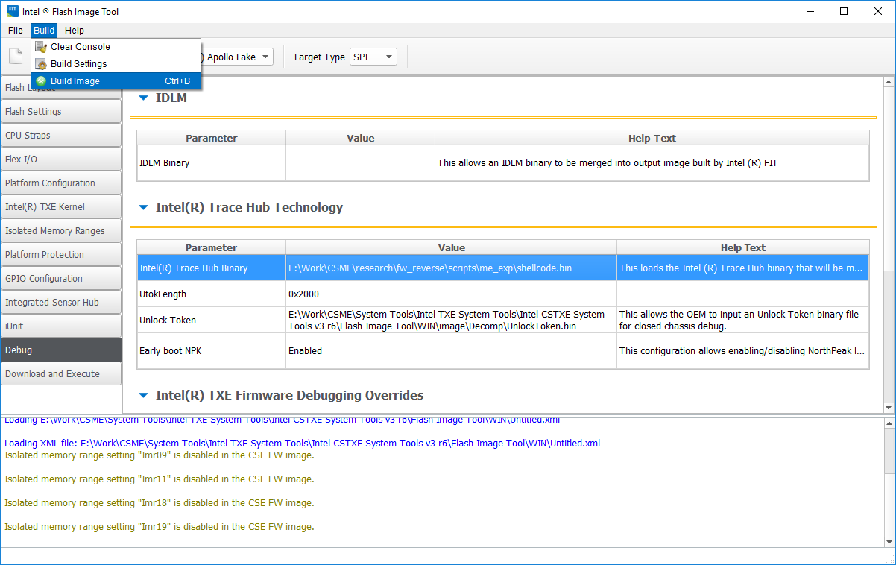

Ignore the message about BootGuard settings (click "Yes"):

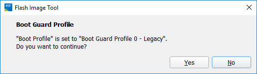

If everything has been done correctly up to this point, the build process should be successful and *FIT* outputs something like the following console message:

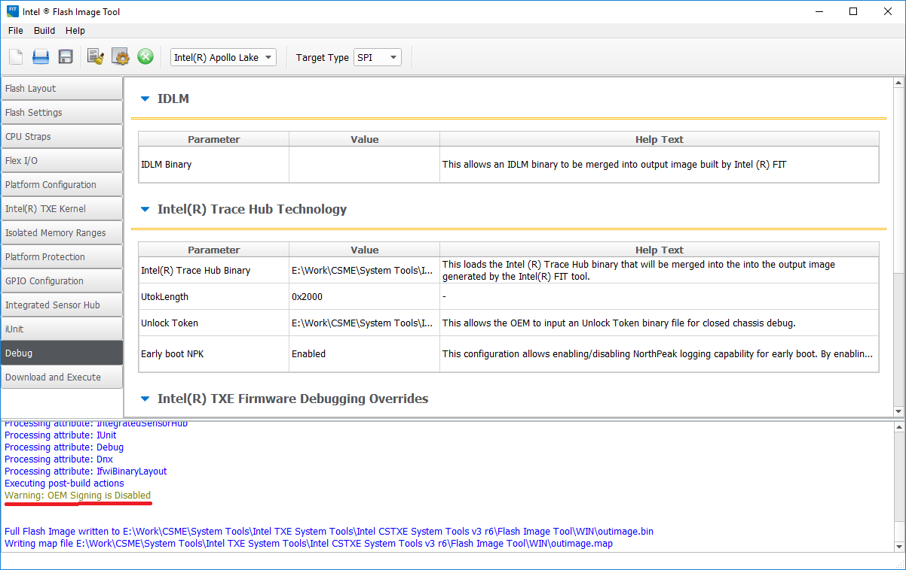

# Writing the Image to SPI Flash[](#writeimage)

**To write the image to SPI flash, we highly recommend using an SPI programmer.  
Be sure to back up the original firmware so you can restore from it if something goes wrong!**

# Preparing the USB Debug Cable

You will need a *USB 3.0 debug cable* to connect to the platform. Either [buy](https://www.datapro.net/products/usb-3-0-super-speed-a-a-debugging-cable.html)  one specially made for the purpose or hack together your own from a USB 3.0 AM–AM cable by isolating the *D+*, *D-*, and *Vcc* contacts.  

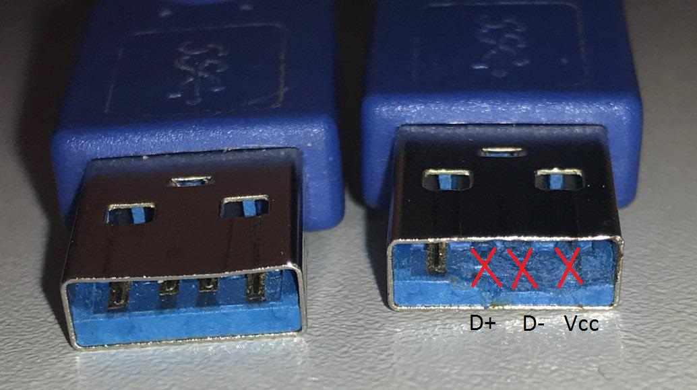

# Patching OpenIPC Configuration Files

Intel develops and provides users with two software packages that can be used for JTAG debugging of platforms and the main CPU: DAL (DFx Abstraction Layer) and *OpenIPC*. Both *DAL* and *OpenIPC* are part of *Intel System Studio*. After installation of *Intel System Studio 2018*, *OpenIPC* appears in the following directory:

Windows
```
C:\Intel\OpenIPC_1.1740.2381.100
```

Linux
```
/opt/intel/system_studio_2018/system_debugger_2018/debugger/openipc
```

The *OpenIPC* configuration is encrypted and does not support the TXE core. So decrypt the configuration and add a TXE description to it. 

## Decrypting OpenIPC Configuration Files

To decrypt the configuration files, extract the key from the *StructuredData* library (linux: *libStructuredData_x64.so*, Windows: *StructuredData_x64.dll*) in *OpenIPC/Bin* using the [IDA Pro](https://www.hex-rays.com/products/ida/support/download_freeware.shtml) script *openipc_key_extract.py*.  Pass the key (in our case, *4504fb02be0a9c4c84df2a89cf508bc3*) to the script *config_decryptor.py* with path to the OpenIPC directory.

```
config_decryptor.py –k 4504fb02be0a9c4c84df2a89cf508bc3 –p C:\Intel\OpenIPC
```

## Adding LMT Core to the Configuration

The supplied version of OpenIPC does not have the necessary information about the TXE core. So we need to apply a patch (*patch.diff*) to the decrypted *OpenIPC* configuration files. Here's how to do it:

```
patch -p2 < patch.diff
```

# Setting the IPC_PATH Environment Variable

After decryption and patching, set the *IPC_PATH* environment variable to the new *OpenIPC* directory so that *ipccli* uses the modified *OpenIPC* version. For instance:

Windows
```
set IPC_PATH=c:\Intel\OpenIPC\Bin
```

# Performing an Initial Check of JTAG Operability

The *activator* blocks subsequent loading by keeping the BUP process in a loop after JTAG is activated. After launch, the platform will not show any signs of life (the monitor does not turn on, keyboard indicators do not light up, and no BIOS POST sound is played). So you will need to check via DCI debugging that the platform has gotten "stuck" in the BUP module.

Like *DAL*, the *OpenIPC* library includes a command-line interface (CLI), written in Python and provided as a library for Python as part of Intel System Studio, which can be installed on the system with the help of pip.
The installation package for ipccli is at the following path:
Windows
```
<Program Files(x86)>\IntelSWTools\system_debugger_2018\debugger\ipccli\ ipccli-1.1740.544.100-py2.py3-none-any.whl
```

Linux
```
/opt/intel/system_studio_2018/system_debugger_2018/debugger/ipccli/ipccli-1.1811.727.100-py2.py3-none-any.whl
```

To install ipccli, run the following console command:

```
pip install ipccli-1.1740.544.100-py2.py3-none-any.whl
```

Once installed, *ipccli* is available within the runtime of the corresponding Python version (the one from which pip was invoked).
To get started with *OpenIPC*, run the following commands in the Python console:
```
import ipccli
ipc = ipccli.baseaccess()
```

The mechanism for connecting to the target platform via DCI launches, resulting in the following console output:

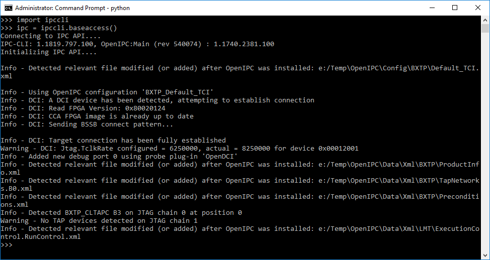

When no connection is established—for example, if the platform is not powered on or is not physically connected via DCI—messages will resemble the following:

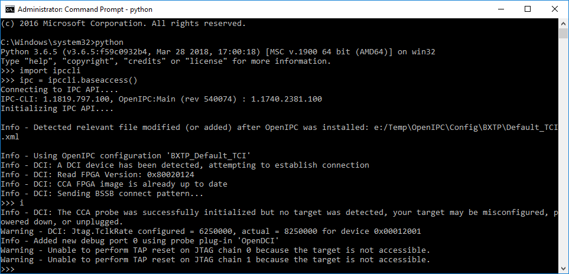

If *DCI* connection is successful, make sure that the *PERSONALITY* register of the *DFX_AGGRAGATOR* device equals 3.
The *PERSONALITY* register has an *IR* (*Instruction Register*) code of *0x54*. To read it, run the following commands:
```
dfx_agg = ipc.devs.mdu_dfx_agg_tap0
ipc.irdrscan(dfx_agg, 0x54, 32)
```

Here is what the result of that command should look like:

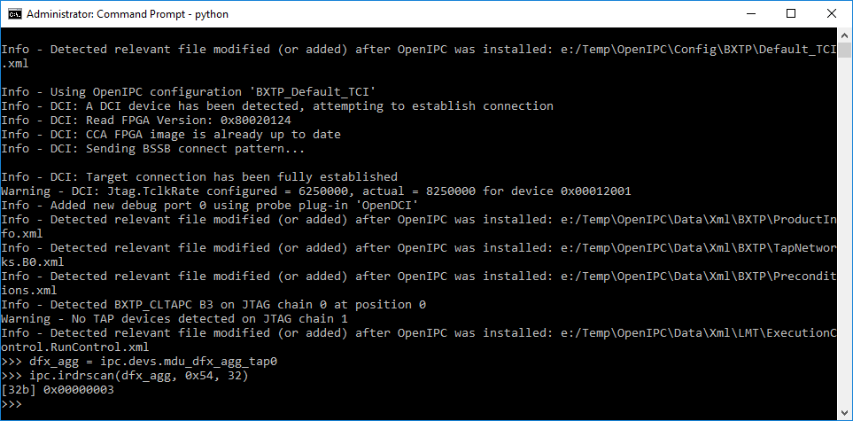


# ME Debugging: Quick Start

The *ipccli* utility comes with rather detailed HTML documentation, which can be found in a folder of the *ipccli* Python package:

```
<Python Dir>\Lib\site-packages\ipccli\html\Index.html
```

## Show CPU ME Thread

If the previous steps have been performed correctly, when a connection to the platform is made via *ipccli*, the *TXE* core is accessible via *CSE Tap* and *ipccli* allows accessing it by applying the following *ipccli* path:

```
ipc.devs.cse_c0.threads[0]
```

But since the PoC blocks loading of the platform until the main CPU is initialized, its cores are inaccessible via JTAG and the ME core can be accessed via the following command:

```
ipc.threads[0]
```

## Halting ME Core

To halt ME processor instructions, run the following command:

```
ipc.threads[0].halt()
```


The console displays the logical address of the instruction at which the halt was made (in our case, *0x1b7:0xa82d*, the *jmp $* instruction, for setting up an infinite loop)

## Reading Arbitrary Memory

*OpenIPC* allows reading memory after the halt, for example:

```
ipc.threads[0].mem("0xf0080004P", 4)
```

You can specify a logical address (*sel:offset*), linear address (*L* modifier), or physical address (*P* modifier).

## Reading ROM

The ME system agent (*MISA*) allows getting the initial physical address of the *ROM* region, which includes the ME reset vector. You can get the *ROM* address via the *Hunit ROM Memory Base* (*HROMMB*) register at offset 0xe20 MISA MMIO (*0xf0000000P*):

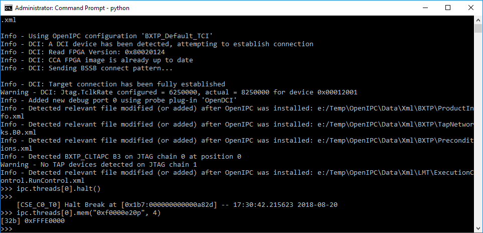

*ROM* always resides from *ROMBASE* to *0xffffffff*
To copy the ROM to a file, run the following command:

```
ipc.threads[0].memsave("<file path>", "0xfffe0000p", 0x20001)
```

It is important to specify the size as *0x20001*, as opposed to *0x20000* (otherwise *OpenIPC* runs into issues due to problems with 64-bit access, which is not possible for the 32-bit ME core). The last byte of the file can be thrown out, since it is not part of the *ROM*.

# Why TXE? 

The platform gives more opportunities for debugging without a special [Intel CCA-SVT](https://designintools.intel.com/Silicon_View_Technology_Closed_Chassis_Adapter_p/itpxdpsvt.htm) adapter and allows debugging the earliest stages of the TXE core via an ordinary *USB debug cable*.


## Related URLs:

[Intel ME: The Way of the Static Analysis][4]

[Intel DCI Secrets][5]

[Intel ME: Flash File System Explained][6]

[How to Hack a Turned-Off Computer or Running Unsigned Code in Intel Management Engine][7]

[Inside Intel Management Engine][8]


# Authors 
Mark Ermolov ([@\_markel___][1])

Maxim Goryachy ([@h0t_max][2])


# Research Team

Mark Ermolov ([@\_markel___][1])

Maxim Goryachy ([@h0t_max][2])

Dmitry Sklyarov ([@_Dmit][3])


# License
Copyright (c) 2018 Mark Ermolov, Maxim Goryachy at Positive Technologies

Permission is hereby granted, free of charge, to any person obtaining a copy of this software and associated documentation files (the "Software"), to deal in the Software without restriction, including without limitation the rights to use, copy, modify, merge, publish, distribute, sublicense, and/or sell copies of the Software, and to permit persons to whom the Software is furnished to do so, subject to the following conditions:The above copyright notice and this permission notice shall be included in all copies or substantial portions of the Software. 

THE SOFTWARE IS PROVIDED "AS IS", WITHOUT WARRANTY OF ANY KIND, EXPRESS OR IMPLIED, INCLUDING BUT NOT LIMITED TO THE WARRANTIES OF MERCHANTABILITY, FITNESS FOR A PARTICULAR PURPOSE AND NONINFRINGEMENT. IN NO EVENT SHALL THE AUTHORS OR COPYRIGHT HOLDERS BE LIABLE FOR ANY CLAIM, DAMAGES OR OTHER LIABILITY, WHETHER IN AN ACTION OF CONTRACT, TORT OR OTHERWISE, ARISING FROM, OUT OF OR IN CONNECTION WITH THE SOFTWARE OR THE USE OR OTHER DEALINGS IN THE SOFTWARE.


[1]: https://twitter.com/_markel___
[2]: https://twitter.com/h0t_max
[3]: https://twitter.com/_Dmit
[4]: https://www.troopers.de/troopers17/talks/772-intel-me-the-way-of-the-static-analysis/
[5]: http://conference.hitb.org/hitbsecconf2017ams/sessions/commsec-intel-dci-secrets/
[6]: https://www.blackhat.com/docs/eu-17/materials/eu-17-Sklyarov-Intel-ME-Flash-File-System-Explained-wp.pdf
[7]: https://www.blackhat.com/docs/eu-17/materials/eu-17-Goryachy-How-To-Hack-A-Turned-Off-Computer-Or-Running-Unsigned-Code-In-Intel-Management-Engine-wp.pdf
[8]: https://github.com/ptresearch/IntelME-JTAG
